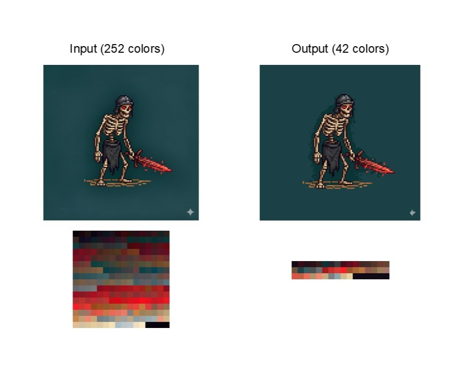

# Perfect Pixel Palette Quantize

> **Auto-detect pixel grids and clean up pixel-art palettes**


Standard scaling often fails to sample AI-generated pixel art due to inconsistent sizes and non-square grids. 

This fork extends the original [theamusing/perfectPixel](https://github.com/theamusing/perfectPixel) project with palette quantization, palette extraction, palette remapping, and a Streamlit web app. The pixel-alignment algorithm is credited to the upstream Perfect Pixel project.

This tool automatically detects the optimal grid and delivers perfectly aligned, pixel-perfect results. It can also simplify noisy AI-generated color ramps into a cleaner, more editable pixel-art palette.

## Features
- Automatically detect grid size from pixel style images.
- Refines AI generated pixel style image to perfectly aligned grids.
- Simplifies noisy AI-generated color ramps into cleaner pixel-art palettes.
- Extracts palettes and remaps images to a fixed target palette for cross-image color consistency.
- Includes a simple Streamlit web app for the full pixel alignment + palette workflow.
- Easy to integrate into your own workflow.

Repository: [ParrotG/perfectPixel-paletteQuantize](https://github.com/ParrotG/perfectPixel-paletteQuantize)

Original pixel-alignment demo: [theamusing.github.io/perfectPixel_webdemo](https://theamusing.github.io/perfectPixel_webdemo/)

## Installation

**Perfect Pixel** provides two implementations of the same core pixel-alignment algorithm. The Lightweight Backend is designed in case you can't or don't want to use cv2. You can choose the one that best fits your environment:

| Feature | OpenCV Backend ([`perfect_pixel.py`](./src/perfect_pixel/perfect_pixel.py)) | Lightweight Backend ([`perfect_pixel_no_cv2.py`](./src/perfect_pixel/perfect_pixel_noCV2.py)) |
| :--- | :--- | :--- |
| **Dependencies** | `opencv-python`, `numpy` | `numpy` |

You can install Perfect Pixel via `pip`. It is recommended to install the OpenCV version for better performance.

```bash
# Recommended: Fast version with OpenCV support
pip install perfect-pixel[opencv]

# Numpy version: Lightweight (NumPy only)
pip install perfect-pixel

# Palette quantization and palette remapping tools
pip install perfect-pixel[palette]

# Streamlit web app
pip install perfect-pixel[webapp]

# Full local workflow with OpenCV, palette tools, and web app
pip install perfect-pixel[opencv,palette,webapp]
```

The palette quantization backend uses `Pillow` and `scikit-learn`. The web app extra installs `streamlit` as well.

## ComfyUI

A ComfyUI custom node is available for integrating Perfect Pixel into ComfyUI workflows.

- No changes to the core Perfect Pixel algorithm
- Provides a ComfyUI-friendly interface for pixel art refinement

- [`Learn how to use Perfect Pixel as a ComfyUI node`](integrations/comfyui/README.md)

## Streamlit Web App

A simple Streamlit web app is included for the complete workflow:

1. Upload a source image.
2. Align the AI-generated pixel art to a clean pixel grid.
3. Calibrate colors by either:
   - uploading a target palette image and remapping to its nearest colors, or
   - automatically merging visually similar colors with Lab-space agglomerative clustering.
4. Preview the result and download the processed image.

Run it from the repository root:

```bash
streamlit run src/perfect_pixel_webapp/app.py
```

## Usage 

### Step 1: Get pixel style image
First you need extra tools to get a pixel styled image. **The recommanded size is between 512 to 1024.**

You can use Stable Diffusion with any Pixel Style Lora, or you can use ChatGPT or Gemini to generate one.


For example, I used ChatGPT to transfer an image into pixel style.

```
prompt: Convert the input image into a TRUE perler bead pixel pattern designed for physical bead crafting, not digital illustration. Canvas size must be exactly 32×32 pixels OR 16×16 pixels, where each pixel represents exactly one perler bead. Use extremely large, chunky pixels with very few active pixels overall. Simplicity is critical. Only keep the main subject. Remove the entire background. For human characters, make sure the face is flat and no shadow. The subject must be centered with clear empty bead rows around all edges to allow easy mounting on a bead board. Add a clean, continuous dark outline around the subject so the silhouette is clearly readable when made with beads. Use a very limited solid color palette (maximum 6–8 colors total). No gradients, no shading, no lighting, no dithering, no texture. No anti-aliasing or smoothing — every pixel must be a perfect square bead aligned to the grid. The output image should be pixel-perfect, each grid only contains one color. Background must be pure solid white.
```


The image is in pixel style but the grids are distorted. Also we don't know the number of grids.

### Step 2: Use Perfect Pixel to refine your image

```python
import cv2
from perfect_pixel import get_perfect_pixel

bgr = cv2.imread("images/avatar.png", cv2.IMREAD_COLOR)
rgb = cv2.cvtColor(bgr, cv2.COLOR_BGR2RGB)

w, h, out = get_perfect_pixel(rgb)
```


*Also see [example.py](./example.py).*
```bash
python example.py
```

The grid size is automatically detected, and the image is refined.


### Step 3: Clean up the color palette

AI-generated pixel art often has another problem after grid alignment: the colors are not truly discrete. Instead of a small hand-editable palette, the image may contain many continuous or irregular color variants. This makes the artwork less stylistically consistent and makes later manual editing harder for pixel artists.

Perfect Palette adds a color quantization step on top of Perfect Pixel. It extracts the image palette, converts unique colors to CIE Lab space, and uses Euclidean-distance-based `AgglomerativeClustering` with complete linkage to automatically merge visually similar colors.



This is useful when you do not want to manually choose a fixed number of colors. Instead, you tune a merge distance: nearby colors are merged, while low-frequency but artistically important accent colors can remain intact.

```python
from PIL import Image

from perfect_palette import extract_palette, save_palette_image
from perfect_palette.color_quantize import simplify_colors_by_lab_threshold_image

image = Image.open("output.png").convert("RGB")

# Automatically merge nearby colors in Lab space.
quantized = simplify_colors_by_lab_threshold_image(
    image=image,
    distance_threshold=15,
)
quantized.save("output_quantized.png")

# Extract and save the resulting palette as a swatch image.
palette, counts = extract_palette(quantized)
save_palette_image(palette, "palette_quantized.png", swatch_size=32, padding=1)
```

You can also remap an image to a specified palette. This is useful when several generated images must share the same colors, for example in a sprite set, icon set, animation, or game asset pack.

```python
from PIL import Image

from perfect_palette import extract_palette, map_image_to_palette, save_palette_image

image = Image.open("output.png").convert("RGB")
palette_image = Image.open("target_palette.png").convert("RGB")

# Extract colors from a palette image.
target_palette, _ = extract_palette(palette_image)
save_palette_image(target_palette, "target_palette_preview.png")

# Map each image color to the nearest target-palette color.
mapped = map_image_to_palette(
    image=image,
    palette=target_palette,
    color_space="lab",
)
mapped.save("output_remapped.png")
```

Try integrating it into your own projects!

## API Reference

### Perfect Pixel

| Args | Description | 
| :--- | :--- |
| **image** | `RGB Image (H * W * 3)` |
| **sample_method** | `"center", "median" or "majority"` |
| **grid_size** | `Manually set grid size (grid_w, grid_h) to override auto-detection` |
| **min_size** | `Minimum pixel size to consider valid` |
| **peak_width** | `Minimum peak width for peak detection.` |
| **refine_intensity** | `Intensity for grid line refinement. Recommended range is [0, 0.5]. Given original estimated grid line at x, the refinement will search in [x * (1 - refine_intensity), x * (1 + refine_intensity)].` |
| **fix_square** | `Whether to enforce output to be square when detected image is almost square.` |
| **debug** | `Whether to show debug plots.` |

| Returns | Description |
| :--- | :--- |
| **refined_w** | `Width of the refined image` |
| **refined_h** | `Height of the refined image` |
| **scaled_image** | `Refined Image(W * H * 3)` |

### Perfect Palette

| Function | Description |
| :--- | :--- |
| **simplify_colors_by_lab_threshold(input_path, output_path, distance_threshold=2.5)** | Load an image from disk, merge visually similar colors in Lab space, and save the result. |
| **simplify_colors_by_lab_threshold_image(image, distance_threshold=2.5)** | In-memory version that accepts a PIL image or RGB/RGBA NumPy array and returns a PIL image. |
| **extract_palette(image, max_colors=None, sort_by="count")** | Extract unique RGB colors and their pixel counts from an image. |
| **save_palette_image(palette, output_path, swatch_size=32, columns=None, padding=0)** | Save a palette as a swatch image. |
| **map_image_to_palette(image, palette, output_path=None, color_space="lab")** | Remap every image color to the nearest color in a target palette. |

`palette` can be a NumPy RGB array, RGB tuples/lists, or hex strings such as `"#ffcc00"`.

## Algorithm


The whole algorithm mainly contains 3 steps:
1. Detect grid size from FFT magnitude of the original image and generate grids.
2. Detect edges using Sobel and refine the grids by aligning them to edges.
3. Use the grids to sample the original image and to get the scaled image.

The color cleanup workflow adds an optional palette stage after grid alignment:

1. Extract unique RGB colors from the pixel-aligned image.
2. Convert those colors to CIE Lab space.
3. Merge nearby colors using complete-linkage agglomerative clustering with a configurable Lab distance threshold.
4. Replace each source color with the medoid color of its cluster.

This differs from common color quantizers such as `Pillow.Image.quantize`, which are usually designed for natural images and often try to preserve continuous gradients while discarding low-frequency colors. Pixel art has different needs: a rare accent color may be more important than a common gradient transition. Complete-linkage agglomerative clustering makes it possible to merge colors only within a chosen perceptual range, preserve outlier accent colors, and avoid manually specifying a fixed number of colors.

## Star History

[](https://www.star-history.com/#ParrotG/perfectPixel-paletteQuantize&type=date&legend=top-left)

## Attribution

This project is released under the MIT License. The pixel-alignment algorithm is credited to [theamusing/perfectPixel](https://github.com/theamusing/perfectPixel), which is also released under the MIT License.

Thanks so much!


